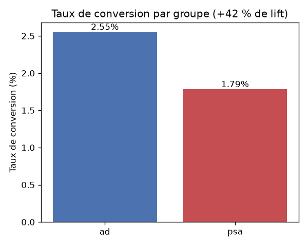
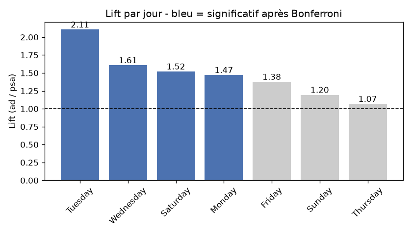

# A/B Testing marketing — quelle campagne convertit le mieux ?

Analyse d'une expérience A/B réelle (588 101 utilisateurs) pour déterminer si une
campagne publicitaire convertit mieux qu'une annonce neutre — et *quand* elle le fait.
Projet mené en autonomie : conception expérimentale, tests statistiques, segmentation,
et recommandation business.

## Question business

Une équipe marketing veut savoir si montrer une **vraie publicité** (`ad`) fait
convertir davantage qu'une **annonce de service public neutre** (`psa`, le groupe
témoin). La décision d'investissement publicitaire en dépend.

## Données

[Marketing A/B Testing — Kaggle](https://www.kaggle.com/datasets/faviovaz/marketing-ab-testing)
· 588 101 lignes (1 par utilisateur), aucune valeur manquante.

| Colonne | Description |
|---|---|
| `test group` | `ad` (a vu la pub) ou `psa` (annonce neutre / témoin) |
| `converted` | l'utilisateur a-t-il converti ? (True / False) — **métrique primaire** |
| `total ads`, `most ads day`, `most ads hour` | contexte d'exposition |

## Démarche

**1 - Cadrage.** H₀ : les deux vrais taux de conversion sont égaux (la pub ne fait
rien). H₁ : ils diffèrent. Métrique : taux de conversion (moyenne de `converted`).
Seuil α = 0,05, test bilatéral.

**2 - Validation des données.** Trois contrôles avant tout test : aucune valeur
manquante ; répartition 96 % / 4 % (déséquilibre voulu, pas de *Sample Ratio
Mismatch* suspect) ; zéro doublon d'utilisateur (personne n'est dans les deux
groupes).

**3 - Test principal.** Métrique binaire → comparaison de deux proportions
(*two-proportion z-test*, `statsmodels`).

**4 - Segmentation.** Analyse jour par jour puis heure par heure, en corrigeant le
risque de faux positifs lié aux comparaisons multiples (**correction de Bonferroni**).

**5 - Visualisation & recommandation.**

## Résultats

**La publicité surpasse l'annonce neutre, de façon statistiquement ET pratiquement
significative.**

| Groupe | Taux de conversion |
|---|---|
| `ad` | **2,55 %** |
| `psa` | 1,79 % |

- **z = 7,37, p ≈ 1,7 × 10⁻¹³** (≪ 0,05) → on rejette H₀.
- **Lift = +42 %** : à nombre égal d'utilisateurs, la pub convertit 1,42 fois plus.



### Segmentation par jour

Le lift n'est pas uniforme sur la semaine. Après correction de Bonferroni
(seuil durci à 0,05 / 7 ≈ 0,0071), **4 jours restent significatifs**, 3 non.



- **Mardi** : le meilleur jour, lift **+111 %** (`ad` élevé, `psa` bas → la pub fait
  toute la différence).
- **Vendredi** : significatif au seuil naïf de 0,05, mais **rejeté** après correction
  — exactement le faux positif que Bonferroni élimine.
- **Jeudi / dimanche** : aucune preuve d'un effet de la pub ces jours-là.

### Limite de la segmentation fine

Descendre au grain **horaire** (~24 tests) fait éclater les sous-groupes (à 4 h, le
groupe `psa` ne compte que 23 personnes) et, combiné à un Bonferroni plus sévère,
étrangle la puissance : une seule heure ressort significative. **Le grain "jour" est
le bon niveau d'analyse ; l'heure est trop fine pour ce jeu de données.** Choisir la
bonne granularité fait partie de l'analyse.

## Recommandation business

> Déployer la vraie campagne publicitaire (+42 % de conversions). Concentrer le budget
> sur le **mardi** (+111 %) et les autres jours à effet significatif ; réévaluer, voire
> couper, la dépense du **jeudi** et du **dimanche**, où aucun gain n'est démontré.

## Stack

Python · pandas · statsmodels · matplotlib

## Structure

```
├── ab_testing_marketing.ipynb   
├── data/                         # marketing_AB.csv 
├── conversion_par_groupe.png
├── lift_par_jour.png
└── README.md
```
